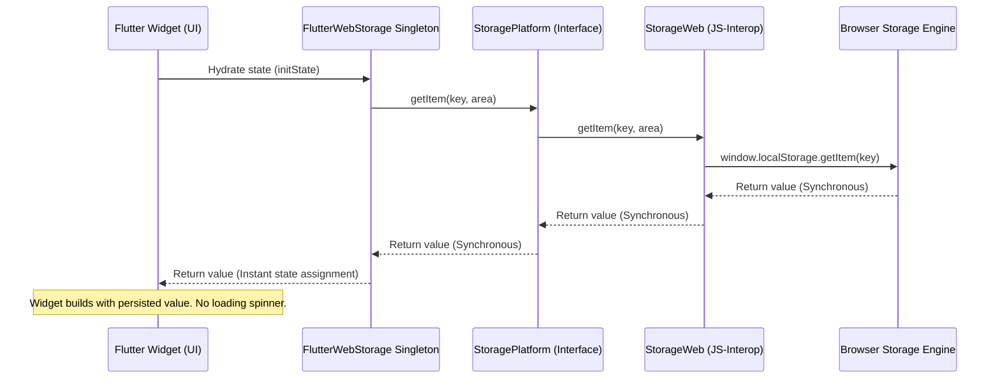
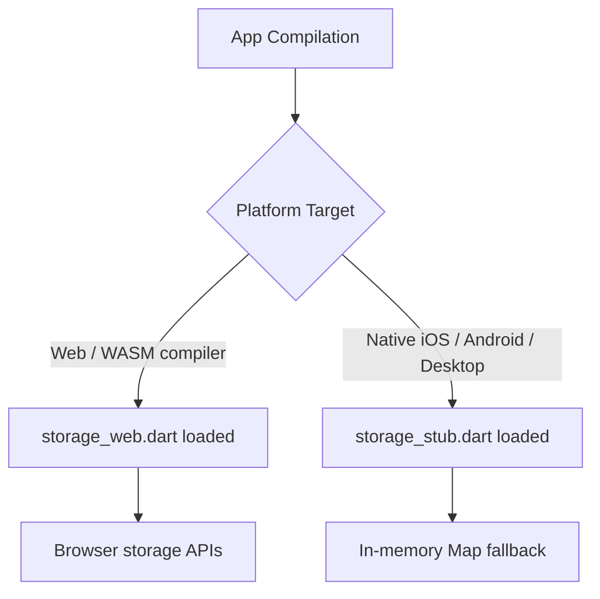

# Technical Documentation and Comparison: flutter_web_storage

This document provides a comprehensive breakdown of the flutter_web_storage package, its design decisions, architecture, and a function-by-function API reference.

---

## The Problem Solved by flutter_web_storage

In Flutter Web development, persisting user inputs, app configurations, and navigation states across browser reloads is a common requirement. While there are several storage solutions in the Flutter ecosystem, they present critical limitations when targeted at the web platform.

### Comparison: flutter_web_storage vs. Alternatives

| Feature / Metric | shared_preferences | Hive | flutter_web_storage |
|---|---|---|---|
| **API Synchronicity** | Asynchronous (Future-based) | Asynchronous (Future-based init/write) | Synchronous (Direct JS-Interop) |
| **Startup UI Flicker** | High (Requires loading screens/builders) | High (Requires box open futures) | Zero (Instant hydration in constructor) |
| **Tab-Scoped Caching** | Not supported (Permanent local storage only) | Not supported (Permanent local storage only) | Native support (sessionStorage) |
| **WASM Compatibility** | Mixed (Legacy JS dependency chains) | Poor (Requires custom indexedDB binaries) | Native (package:web + dart:js_interop) |
| **Platform Portability** | Fallback to disk (Plugin dependent) | Fallback to disk (Requires path provider) | Fallback to in-memory stub (Zero dependencies) |

### 1. The Startup UI Flicker Problem (shared_preferences)
When a user refreshes a web page (F5), standard Flutter code initializes state variables to their defaults. Because `shared_preferences` relies on asynchronous read operations (`Future<SharedPreferences>`), the UI is drawn with default values before the stored value is retrieved. This latency results in a visible UI flash or flicker. 

`flutter_web_storage` solves this by using synchronous Dart-JS interop bindings. Since read operations map directly to synchronous browser API calls (`window.localStorage.getItem`), the state hydrates instantly inside the constructor or `initState`, bypassing asynchronous microtasks.

### 2. Over-engineering and Setup Overhead (Hive)
`Hive` is a powerful database engine but introduces excessive complexity for basic key-value storage. It requires asynchronous path registration, database initialization, and code-generation configurations (`build_runner`) for custom models. Furthermore, running native database engines on WebAssembly targets requires separate database setups.

`flutter_web_storage` provides lightweight, codegen-free JSON serialization, allowing direct storage of maps and lists without setup routines.

### 3. Session Isolation
Standard shared storage libraries only write to permanent browser storage. `flutter_web_storage` natively separates data between `localStorage` (permanent across browser restarts) and `sessionStorage` (isolated per tab, survives F5 reload, but perishes once the tab is closed).

---

## Architectural Flow Diagrams

### Data Hydration Flow (Zero-Flicker)



### Multiplatform Target Resolution



---

## Browser Storage Security and Web Permissions

Standard browser storage APIs (`localStorage` and `sessionStorage`) operate inside the browser's sandboxed security model.

1. **Permissions**: Unlike camera, microphone, or location APIs, browser storage does **not** require user permission prompts. It is granted automatically to every website.
2. **Origin Sandbox**: Storage is bound to the origin (Protocol + Domain + Port). Code running on `https://example.com` cannot read storage written by `https://another-domain.com`.
3. **Storage Quota**: Browsers typically limit storage to 5MB to 10MB per origin. Storing massive data payloads may trigger a quota exceeded exception.

---

## Showcase


## Detailed Function and API Reference

### 1. Primitive Read/Write Methods

#### `getString` / `setString`
Retrieves or stores a raw text value.
```dart
void setString(String key, String value, {StorageArea area = StorageArea.session});
String? getString(String key, {StorageArea area = StorageArea.session});
```

#### `getInt` / `setInt`
Retrieves or stores an integer. Performs string conversion under the hood.
```dart
void setInt(String key, int value, {StorageArea area = StorageArea.session});
int? getInt(String key, {StorageArea area = StorageArea.session});
```

#### `getDouble` / `setDouble`
Retrieves or stores a floating-point number.
```dart
void setDouble(String key, double value, {StorageArea area = StorageArea.session});
double? getDouble(String key, {StorageArea area = StorageArea.session});
```

#### `getBool` / `setBool`
Retrieves or stores a boolean value.
```dart
void setBool(String key, bool value, {StorageArea area = StorageArea.session});
bool? getBool(String key, {StorageArea area = StorageArea.session});
```

### 2. Lists & Arrays

#### `getStringList` / `setStringList`
Serializes and deserializes a list of strings using JSON encoding.
```dart
void setStringList(String key, List<String> value, {StorageArea area = StorageArea.session});
List<String>? getStringList(String key, {StorageArea area = StorageArea.session});
```

#### `getObjectList` / `setObjectList`
Persists a list of custom objects by serializing each object through a `toJson` map callback, and reconstructing them via a `fromJson` constructor.
```dart
void setObjectList<T>(
  String key,
  List<T> list,
  Map<String, dynamic> Function(T item) toJson, {
  StorageArea area = StorageArea.session,
});

List<T>? getObjectList<T>(
  String key,
  T Function(Map<String, dynamic> json) fromJson, {
  StorageArea area = StorageArea.session,
});
```

### 3. JSON & Custom Models

#### `getJson` / `setJson`
Stores or retrieves a raw JSON map structure.
```dart
void setJson(String key, Map<String, dynamic> value, {StorageArea area = StorageArea.session});
Map<String, dynamic>? getJson(String key, {StorageArea area = StorageArea.session});
```

#### `getObject` / `setObject`
Saves or loads a single custom model object.
```dart
void setObject<T>(
  String key,
  T object,
  Map<String, dynamic> Function(T item) toJson, {
  StorageArea area = StorageArea.session,
});

T? getObject<T>(
  String key,
  T Function(Map<String, dynamic> json) fromJson, {
  StorageArea area = StorageArea.session,
});
```

### 4. Reactive Streams

#### `watchString`
Returns a stream emitting value updates for a specific key. It triggers both when updates occur in the current tab and when updates sync from other open browser tabs.
```dart
Stream<String?> watchString(String key, {StorageArea area = StorageArea.session});
```

#### `watchJson`
Listens to map values reactively.
```dart
Stream<Map<String, dynamic>?> watchJson(String key, {StorageArea area = StorageArea.session});
```

#### `watch<T>`
Listens to custom model states reactively, reconstructing the type via the optional decoder callback.
```dart
Stream<T?> watch<T>(
  String key, {
  T Function(dynamic raw)? decoder,
  StorageArea area = StorageArea.session,
});
```

### 5. Utility Functions

#### `containsKey`
Checks if a key exists in the storage area.
```dart
bool containsKey(String key, {StorageArea area = StorageArea.session});
```

#### `remove`
Deletes a specific key.
```dart
void remove(String key, {StorageArea area = StorageArea.session});
```

#### `clear`
Deletes all values in the targeted area.
```dart
void clear({StorageArea area = StorageArea.session});
```

#### `getKeys`
Retrieves a set of all keys present in the specified area.
```dart
Set<String> getKeys({StorageArea area = StorageArea.session});
```
