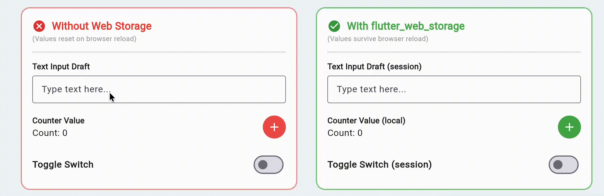
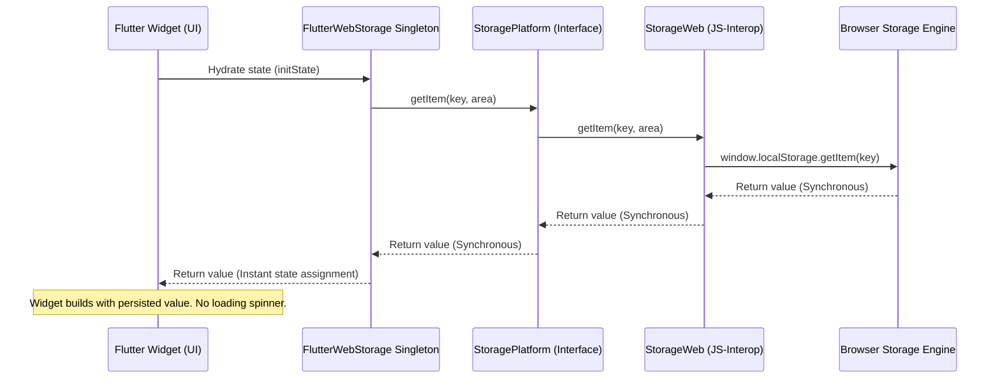
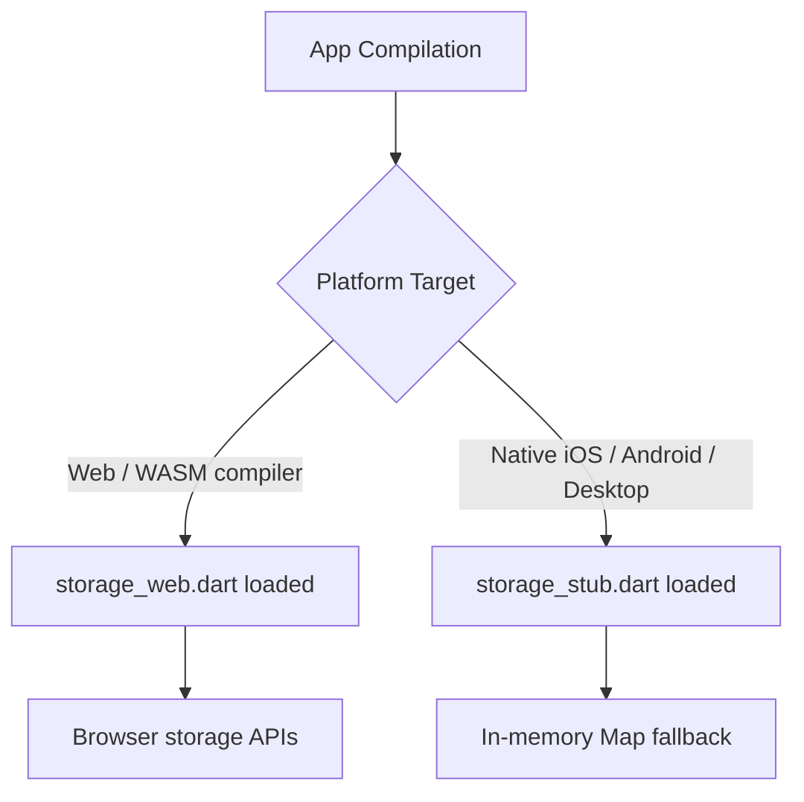

# flutter_web_storage

A production-grade, WASM-Ready, and Multiplatform-Safe Flutter package for accessing localStorage and sessionStorage with zero UI flicker. Features reactive streams, deep link route preservation on browser refresh (F5), and drop-in reload-safe UI controllers.

[](https://pub.dev/packages/flutter_web_storage)
[](https://opensource.org/licenses/MIT)
[](#)

---

## Showcase



---

## Core Architecture and Design Philosophy

In the Flutter ecosystem, different storage packages are designed for different optimal use cases. Understanding their trade-offs helps select the right tool for the web platform:

1. **Standard Asynchronous Storage (e.g. SharedPreferences)**: Designed for simple key-value settings. On mobile, it writes to disk asynchronously, which is ideal for native threads. On web, the asynchronous initialization can cause the UI to build before the state is recovered, resulting in a visible layout flicker.
2. **Encrypted Key-Value Storage (e.g. Secure Storage)**: Designed for sensitive tokens. It binds to native device keychains (like iOS Keychain and Android Keystore). On web, since there is no native hardware security keychain, it falls back to unencrypted storage or WebCrypto, which operates asynchronously and cannot prevent access from malicious scripts running on the same origin.
3. **Relational and Object Databases (e.g. SQLite, Isar, ObjectBox)**: Designed for complex querying, massive datasets, and relations. On web, they run on IndexedDB or custom WASM compilations. While excellent for offline-first data, they carry substantial bundle size overhead and are complex for simple tab-scoped session caching.
4. **flutter_web_storage**: Optimized specifically for **instant, tab-isolated, zero-flicker key-value state hydration on the web** using direct synchronous JS-Interop.

### Technical Comparison Matrix

| Feature / Metric | Standard Async Storage | Encrypted Key-Value | Relational & Object DBs | flutter_web_storage |
|---|---|---|---|---|
| **Primary Use Case** | Basic key-value settings | Secure credentials | Heavy relational datasets | Web state persistence |
| **API Synchronicity** | Asynchronous (Future) | Asynchronous (Future) | Asynchronous (Future/Stream) | Synchronous (JS-Interop) |
| **Startup UI Flicker** | High | High | High | Zero (Instant hydration) |
| **Tab Isolation** | No | No | No | Yes (sessionStorage) |
| **WASM Performance** | Standard bridge | Crypto overhead | Heavy WASM engine | Native interop (zero cost) |
| **Native Portability** | Disk serialization | Keychain integration | Native binary engine | In-memory fallback stub |

### Technical Trade-Off Explanations

#### 1. The Startup UI Flicker Problem
When a user refreshes a web page (F5), standard Flutter code initializes state variables to their defaults. Because standard asynchronous storage utilities rely on asynchronous read operations, the UI is drawn with default values before the stored value is retrieved. This latency results in a visible UI flash or flicker. 

flutter_web_storage solves this by using synchronous Dart-JS interop bindings. Since read operations map directly to synchronous browser API calls (window.localStorage.getItem), the state hydrates instantly inside the constructor or initState, bypassing asynchronous microtasks.

#### 2. Over-engineering and Setup Overhead
Standard relational/object databases are powerful database engines but introduce complexity for basic key-value storage. They require asynchronous path registration, database initialization, and code-generation configurations for custom models. 

flutter_web_storage provides lightweight, codegen-free JSON serialization, allowing direct storage of maps and lists without setup routines.

#### 3. Session Isolation
Standard shared storage libraries only write to permanent browser storage. flutter_web_storage natively separates data between localStorage (permanent across browser restarts) and sessionStorage (isolated per tab, survives F5 reload, but perishes once the tab is closed).

---

## Architectural Flow Diagrams

### Data Hydration Flow (Zero-Flicker)



### Multiplatform Target Resolution



---

## Browser Storage Security and Web Permissions

Standard browser storage APIs (localStorage and sessionStorage) operate inside the browser's sandboxed security model.

1. **Permissions**: Unlike camera, microphone, or location APIs, browser storage does not require user permission prompts. It is granted automatically to every website.
2. **Origin Sandbox**: Storage is bound to the origin (Protocol + Domain + Port). Code running on https://example.com cannot read storage written by https://another-domain.com.
3. **Storage Quota**: Browsers typically limit storage to 5MB to 10MB per origin. Storing massive data payloads may trigger a quota exceeded exception.

---

## Installation

Add the dependency to your pubspec.yaml:

```yaml
dependencies:
  flutter_web_storage: ^1.0.0
```

---

## Detailed Function and API Reference

All functions are accessed via the `FlutterWebStorage.instance` singleton. You can specify `StorageArea.local` (localStorage) or `StorageArea.session` (sessionStorage).

### 1. Primitive Read/Write Methods

#### `getString` / `setString`
Retrieves or stores a raw text value.
```dart
void setString(String key, String value, {StorageArea area = StorageArea.session});
String? getString(String key, {StorageArea area = StorageArea.session});
```
Example:
```dart
final storage = FlutterWebStorage.instance;
storage.setString('username', 'Alex', area: StorageArea.local);
String? name = storage.getString('username', area: StorageArea.local);
```

#### `getInt` / `setInt`
Retrieves or stores an integer. Performs string conversion under the hood.
```dart
void setInt(String key, int value, {StorageArea area = StorageArea.session});
int? getInt(String key, {StorageArea area = StorageArea.session});
```
Example:
```dart
storage.setInt('app_counter', 10, area: StorageArea.local);
int? counter = storage.getInt('app_counter', area: StorageArea.local);
```

#### `getDouble` / `setDouble`
Retrieves or stores a floating-point number.
```dart
void setDouble(String key, double value, {StorageArea area = StorageArea.session});
double? getDouble(String key, {StorageArea area = StorageArea.session});
```
Example:
```dart
storage.setDouble('app_rating', 4.5);
double? rating = storage.getDouble('app_rating');
```

#### `getBool` / `setBool`
Retrieves or stores a boolean value.
```dart
void setBool(String key, bool value, {StorageArea area = StorageArea.session});
bool? getBool(String key, {StorageArea area = StorageArea.session});
```
Example:
```dart
storage.setBool('theme_dark', true);
bool? isDark = storage.getBool('theme_dark');
```

### 2. Lists & Arrays

#### `getStringList` / `setStringList`
Serializes and deserializes a list of strings using JSON encoding.
```dart
void setStringList(String key, List<String> value, {StorageArea area = StorageArea.session});
List<String>? getStringList(String key, {StorageArea area = StorageArea.session});
```
Example:
```dart
storage.setStringList('user_tags', ['Flutter', 'WebAssembly']);
List<String>? tags = storage.getStringList('user_tags');
```

#### `getObjectList` / `setObjectList`
Persists a list of custom objects by serializing each object through a toJson map callback, and reconstructing them via a fromJson constructor.
```dart
void setObjectList<T>(
  String key,
  List<T> list,
  Map<String, dynamic> Function(T item) toJson, {
  StorageArea area = StorageArea.session,
});

List<T>? getObjectList<T>(
  String key,
  T Function(Map<String, dynamic> json) fromJson, {
  StorageArea area = StorageArea.session,
});
```
Example:
```dart
class Task {
  final String id;
  final String title;
  Task(this.id, this.title);
  Map<String, dynamic> toJson() => {'id': id, 'title': title};
  factory Task.fromJson(Map<String, dynamic> json) => Task(json['id'], json['title']);
}

// Write object list
final tasks = [Task('1', 'Fix bugs'), Task('2', 'Review code')];
storage.setObjectList<Task>('todo_list', tasks, (t) => t.toJson());

// Read object list
List<Task>? retrievedTasks = storage.getObjectList<Task>('todo_list', Task.fromJson);
```

### 3. JSON & Custom Models

#### `getJson` / `setJson`
Stores or retrieves a raw JSON map structure.
```dart
void setJson(String key, Map<String, dynamic> value, {StorageArea area = StorageArea.session});
Map<String, dynamic>? getJson(String key, {StorageArea area = StorageArea.session});
```
Example:
```dart
final profile = {'username': 'Alex', 'role': 'Admin'};
storage.setJson('user_profile', profile);
Map<String, dynamic>? data = storage.getJson('user_profile');
```

#### `getObject` / `setObject`
Saves or loads a single custom model object.
```dart
void setObject<T>(
  String key,
  T object,
  Map<String, dynamic> Function(T item) toJson, {
  StorageArea area = StorageArea.session,
});

T? getObject<T>(
  String key,
  T Function(Map<String, dynamic> json) fromJson, {
  StorageArea area = StorageArea.session,
});
```
Example:
```dart
final user = User(id: '101', name: 'Frank');
storage.setObject<User>('current_user', user, (u) => u.toJson());
User? activeUser = storage.getObject<User>('current_user', User.fromJson);
```

### 4. Reactive Streams

#### `watchString`
Returns a stream emitting value updates for a specific key. It triggers both when updates occur in the current tab and when updates sync from other open browser tabs.
```dart
Stream<String?> watchString(String key, {StorageArea area = StorageArea.session});
```
Example:
```dart
StreamBuilder<String?>(
  stream: storage.watchString('live_status'),
  builder: (context, snapshot) {
    return Text('Status: ${snapshot.data ?? ""}');
  },
);
```

#### `watchJson`
Listens to map values reactively.
```dart
Stream<Map<String, dynamic>?> watchJson(String key, {StorageArea area = StorageArea.session});
```

#### `watch<T>`
Listens to custom model states reactively, reconstructing the type via the optional decoder callback.
```dart
Stream<T?> watch<T>(
  String key, {
  T Function(dynamic raw)? decoder,
  StorageArea area = StorageArea.session,
});
```

### 5. Utility Functions

#### `containsKey`
Checks if a key exists in the storage area.
```dart
bool containsKey(String key, {StorageArea area = StorageArea.session});
```

#### `remove`
Deletes a specific key.
```dart
void remove(String key, {StorageArea area = StorageArea.session});
```

#### `clear`
Deletes all values in the targeted area.
```dart
void clear({StorageArea area = StorageArea.session});
```

#### `getKeys`
Retrieves a set of all keys present in the specified area.
```dart
Set<String> getKeys({StorageArea area = StorageArea.session});
```

### 6. Navigation Route Preservation (Navigator 2.0 & GoRouter)

To preserve the navigation state on browser reload, attach `WebRoutePreserverNavigatorObserver` to your navigator observers.

```dart
MaterialApp(
  navigatorObservers: [WebRoutePreserverNavigatorObserver()],
  initialRoute: getRestoredRoute(defaultRoute: '/'),
  routes: {
    '/': (context) => const StorageDashboard(),
    '/subpage': (context) => const SubPageDemo(),
  },
  onUnknownRoute: (settings) {
    return MaterialPageRoute(
      settings: settings,
      builder: (context) => const StorageDashboard(),
    );
  },
);
```

### 7. Drop-in UI Controllers

#### `ReloadSafeTextEditingController`
A `TextEditingController` subclass that auto-saves user typing into sessionStorage so it survives reloads.
```dart
late final ReloadSafeTextEditingController _inputController;

@override
void initState() {
  super.initState();
  _inputController = ReloadSafeTextEditingController(
    key: 'profile_draft',
    defaultValue: 'John Doe',
  );
}
```

#### `ReloadSafeNotifier<T>`
A `ValueNotifier<T>` subclass that auto-persists state modifications. Supports custom object serialization.
```dart
late final ReloadSafeNotifier<int> _notifier;

@override
void initState() {
  super.initState();
  _notifier = ReloadSafeNotifier<int>(
    key: 'live_counter',
    defaultValue: 0,
    area: StorageArea.local,
  );
}
```

## Author

Developed and maintained by **Muhammad Omar**.

* Website: [momarkhan.com](https://momarkhan.com)
* LinkedIn: [Muhammad Omar](https://www.linkedin.com/in/muhammad-omar-0335/)

---

## Contributions

Contributions are welcome! If you find a bug, have a feature request, or want to contribute code, please follow these steps:

1. **Issues**: Open an issue on GitHub to discuss bugs or feature suggestions.
2. **Pull Requests**:
   - Fork the repository.
   - Create a feature branch (`git checkout -b feature/amazing-feature`).
   - Run `flutter analyze` to ensure no lint warnings or compilation errors exist.
   - Run `flutter test` to verify that all unit and widget tests pass.
   - Commit your changes (`git commit -m 'Add amazing feature'`).
   - Push to the branch (`git push origin feature/amazing-feature`).
   - Open a Pull Request on the main repository.

---

## License

This project is licensed under the MIT License - see the LICENSE file for details.
